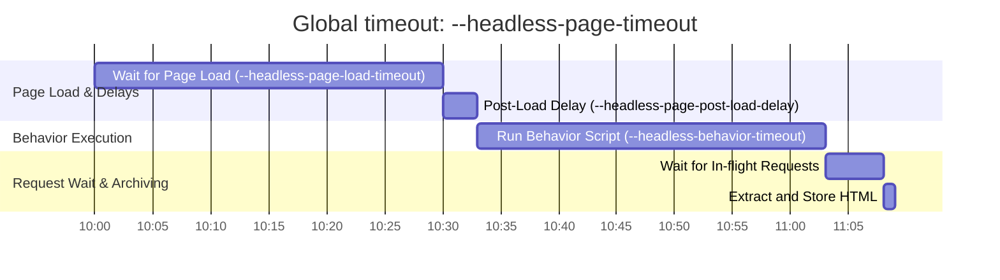

# Headless/Headfull Archiver

`behaviors.js` builds from the [browsertrix-behaviors](https://github.com/webrecorder/browsertrix-behaviors) v0.9.0 (AGPL-3.0).

## Differences from general archiver

- All assets extractors are disabled

## Timeouts

---

TODOs:

- [ ] Retry on bad status codes
