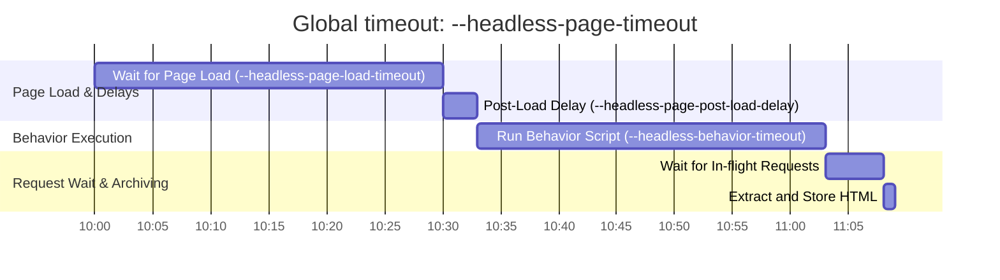

# Headless/Headful Browser-based Archiver

`behaviors.js` builds from the [browsertrix-behaviors](https://github.com/webrecorder/browsertrix-behaviors) v0.9.2 (AGPL-3.0). It provides the core browser automation behaviors (like clicking play buttons, scrolling, etc.) for archiving.

## Differences from general archiver

1. All assets extractors are disabled.

2. Redirects are handled by the browser itself.

3. The `GetResponse()` always returns nil.

```golang
//	In normal mode, GetResponse() always returns a valid *http.Response
//	In headless mode, GetResponse() always returns nil
func (u *URL) GetResponse()
```

4. Content-Type and MIME Type Handling

In the browser context, everything is essentially rendered as an HTML page (more precisely, a DOM tree). Chromium renders even non-HTML resources within an HTML container.

For example, when opening an .mp4 URL in a browser tab, it creates an HTML container to render the video:

```html
<html>
<head><meta name="viewport" content="width=device-width"></head>
<body><video controls="" autoplay="" name="media"><source src="{URL}" type="video/mp4"></video></body>
</html>
```

So, I have to use Chromium processed DOM html as `item.body` for post-processing. This is because the web page DOM is not necessarily composed from one specific request, especially when the web page is dynamic and driven by JS. See `extractAndStoreHTML()` for details.

Therefore:

- The `contentType` for outlinks extractors been hardcoded to `text/html`.

```golang
// func extractOutlinks():
if item.GetURL().GetResponse() != nil {
    contentType = item.GetURL().GetResponse().Header.Get("Content-Type")
} else {
    contentType = "text/html" // Headless, hardcoded to HTML
}
```
- For the `MIMEType`, although it is not hardcoded, it will most likely still be detected as `text/html` because it is extracted from the DOM processed by Chromium.

```golang
// func extractAndStoreHTML():
docEl, err := page.Element("*")
htmlText, err := docEl.HTML()
item.GetURL().SetMIMEType(mimetype.Detect(htmlText))
```

5. seencheck is called for each request.

To reduce the number of duplicate requests in headless mode, we have to call seencheck for each request before sending it.
If requests are seen and it's a discardable resource, we discard it.

```golang
// func archivePage():
isSeen := seencheck(hijack.Request.URL().String())
if isSeen {
	switch hijack.Request.Type() {
	case proto.NetworkResourceTypeImage, proto.NetworkResourceTypeMedia, proto.NetworkResourceTypeFont, proto.NetworkResourceTypeStylesheet:
		logger.Debug("request has been seen before and is a discardable resource. Skipping it")
		hijack.Response.Fail(proto.NetworkErrorReasonBlockedByClient)
		return
	}
}
```

> You may notice this behavior impact your `--headless-headful` rendering, but the WARC output should remain replayable.

## Timeouts configuration



## Write a outlinks extractor that works for headless mode

Declare your extractor Support the headless mode.

```golang
func (MyOutlinkExtractor) Support(m Mode) bool {
	return m == ModeGeneral || m == ModeHeadless // both modes are supported
}
```

And just two things to keep in mind:

1. The `GetResponse()` method will always return nil in headless mode.
2. Everything is rendered as an HTML page. `GetDocumentCache()` can be used to access the DOM tree.

---

TODOs:

- [ ] Retry on bad status codes
